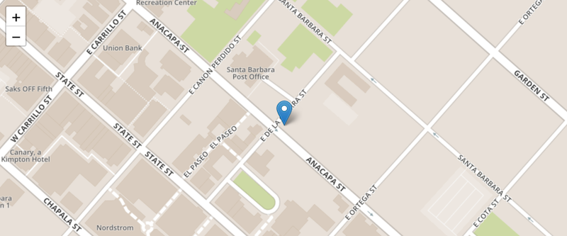
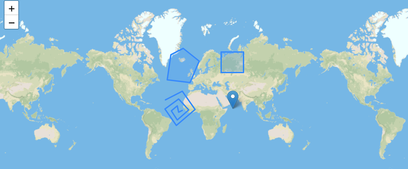

# Ginkgoch Geometries for Node.js
This project provides the basic functions for geometries.

1. Construct `Point`, `LineString`, `Polygon`, `MultiPoint`, `MultiLineString`, `MultiPolygon` and `GeometryCollection` with will defined APIs.
1. Calculate geometry self information such as area, perimeter etc.
1. Converts geometry format between `wkt`, `wkb`, `json` and Ginkgoch geometry classes.
1. Support popular geo-spatial analyzing methods.

## Install
```
yarn add ginkgoch-geom
```

## Docs
Visit [https://ginkgoch.github.io/node-geom](https://ginkgoch.github.io/node-geom) for detail.

## Demo

Full demo, please play on RunKit at: https://runkit.com/ginkgoch/geometry-demo

This is about how to use `ginkgoch-geom` library to create your own geometries and convert to various formats. The first on is about location. I will create a point that is located to a city in LA. It is easy to convert to GeoJSON format.

```javascript
const geom = require("ginkgoch-geom")
const point = new geom.Point(-119.698189, 34.420830);
point.toJSON();
```



Except point, it is also allow to create other geometries such as line, polygon or multi-point, multi-line, multi-polygon etc.

```javascript
const getJSON = require("async-get-json");

const geomURL = 'https://github.com/ginkgoch/map-data-demo/raw/master/json/geometries.json';
const geomJson = (await getJSON(geomURL));
geom.FeatureCollection.create(geomJson).toJSON();
```



For more demos about converting to well-known text (WKT), well-known binary (WKB) or spatial analyzing, please try on [RunKit](https://runkit.com/ginkgoch/geometry-demo) directly. If anything interesting, feel free to contact me with [ginkgoch@outlook.com](mailto:ginkgoch@outlook.com), I'm glad to help.

The is the low-level library in my `mapping echo system`. Please watch me on github for more function with map support on Node.js. 

Happy Mapping!

